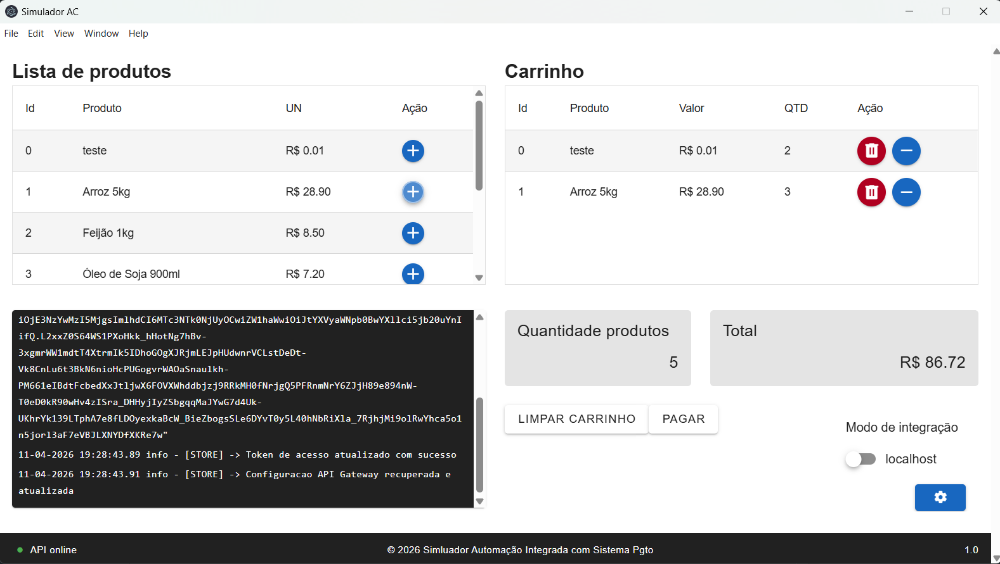

<h1 align="center">Simulador AC</h1>

<p align="center">
  
  
  
  
</p>

<p align="center">
  Simulador de Automação Comercial (AC) integrado com sistema de pagamento. Aplicação desktop construída com Electron e Vue.js.
</p>

---

## Prévia

<p align="center">
  
</p>

## Início rápido

### Variáveis de Ambiente

Crie um arquivo `.env` na raiz do projeto baseado no `.env.example`:

```env
VITE_CLIENT_ID=
VITE_USERNAME=
VITE_PASSWORD=
VITE_OAUTH_URL=
VITE_API_GATEWAY_URL=
VITE_NGROK_AUTHTOKEN=
```

### Instalação

Clone o repositório e instale as dependências:

```bash
npm install
```

### Desenvolvimento

Inicie a aplicação no modo de desenvolvimento:

```bash
npm run dev
```

### Build

Gere o executável para Windows:

```bash
npm run build:win
```

@2026 - LET
